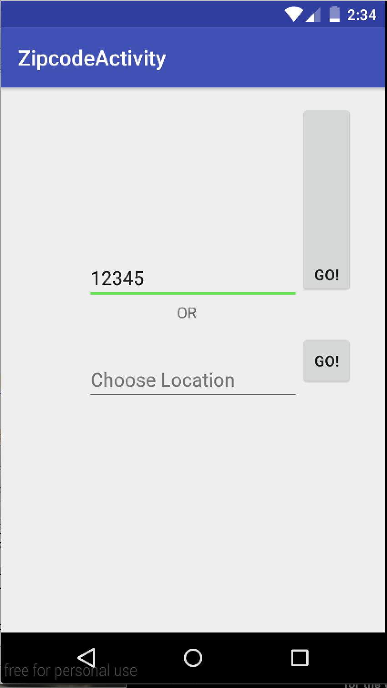

# PROG 02: Represent!

This app will teach you about the Congressional Representatives of your area!

## Authors

Ashley Collins ([a.collins05@berkeley.edu](mailto:a.collins05@berkeley.edu))

## Demo Video

See [your demo video title here] (https://link_to_your_video)

## Screenshots

## Acknowledgments

I would like to thank the wonderful Android Dev Docs and Stack Overflow for Implementing the Shake Feature!
